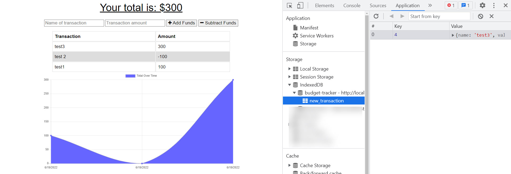
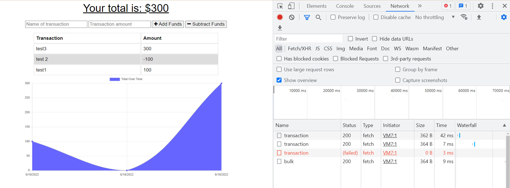

During week 13 of UTSA's Coding Bootcamp, we were given a directive of creating a Progressive Web Applications (PWA) Challenge: Budget Tracker for an avid traveler who wants to be able to track withdrawls and deposits with or without data/internet connection. There were a number of requirements to meet, such as:

GIVEN a budget tracker without an internet connection
WHEN the user inputs an expense or deposit
THEN they will receive a notification that they have added an expense or deposit
WHEN the user reestablishes an internet connection
THEN the deposits or expenses added while they were offline are added to their transaction history and their totals are updated

We were provided starter code from @Xandromus's coding bootcamp repo: https://github.com/coding-boot-camp/symmetrical-bassoon. All other coding was done by me in VS Code and saved in GitHub and deployed to Heroku.

You can find my repo code here: https://github.com/amhernandez1163/pwa-budget-19
Heroku Deployed App (wip): https://fierce-everglades-62175.herokuapp.com/

